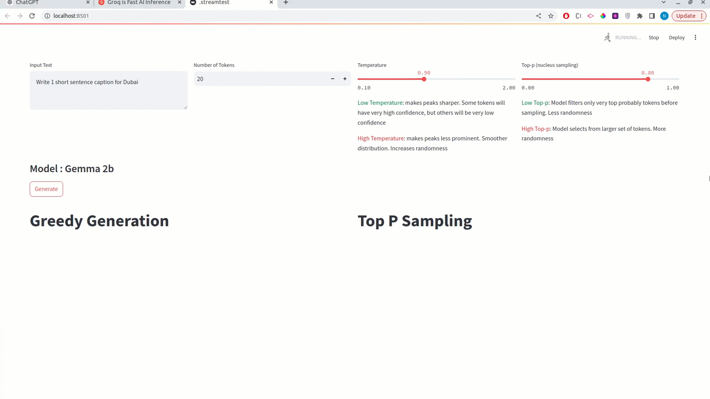

# Temperature and Top-P Sampling in LLMs

Understanding and exploring affects of temperature and top-p sampling in language generation. We will be testing the sampling approaches in Gemma-2b-it

## Overview

Understanding and exploring affects of temperature and top-p sampling in language generation. We will be testing the sampling approaches in Gemma-2b-it

Refer Medium Article : [link](https://medium.datadriveninvestor.com/temperature-and-top-p-sampling-in-llms-453bcd888f13)

## Code

- `EDA.ipynb` contains some experiments with top p and temperature
- `streamlit_app.py`: Contains the streamlit application. Its ugly code.
- `gpt_refactored_app.py`: Contains the above file refactored by chatgpt :) Looks nicer

